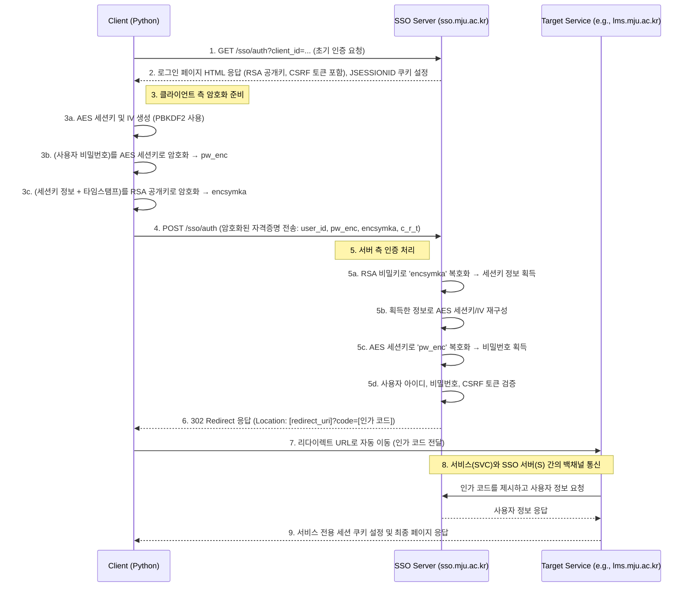

# 명지대학교 SSO 통합인증 기술 문서

## 목차
1. [개요](#1-개요)
   - [문서의 목적](#문서의-목적)
   - [대상 시스템](#대상-시스템)
   - [사용된 주요 기술](#사용된-주요-기술)
2. [핵심 기술 및 원리](#2-핵심-기술-및-원리)
   - [SSO (Single Sign-On)](#sso-single-sign-on)
   - [OAuth 2.0 Authorization Code Grant Flow](#oauth-20-authorization-code-grant-flow)
   - [하이브리드 암호화 (Hybrid Encryption)](#하이브리드-암호화-hybrid-encryption)
     - [비대칭키 암호화: RSA-PKCS1-v1.5](#비대칭키-암호화-rsa-pkcs1-v1_5)
     - [대칭키 암호화: AES-256-CBC](#대칭키-암호화-aes-256-cbc)
   - [키 파생 함수: PBKDF2](#키-파생-함수-pbkdf2)
   - [CSRF (Cross-Site Request Forgery) 방어](#csrf-cross-site-request-forgery-방어)
3. [전체 로그인 워크플로우](#3-전체-로그인-워크플로우)
   - [시퀀스 다이어그램](#시퀀스-다이어그램)
   - [프로세스 요약](#프로세스-요약)
4. [상세 분석: 단계별 요청과 응답](#4-상세-분석-단계별-요청과-응답)
   - [Step 1: 로그인 페이지 요청 및 분석 (GET)](#step-1-로그인-페이지-요청-및-분석-get)
     - [클라이언트 요청](#클라이언트-요청)
     - [서버 응답](#서버-응답)
     - [클라이언트 분석 (`_parse_login_page`)](#클라이언트-분석-_parse_login_page)
   - [Step 2: 클라이언트 암호화 데이터 준비 (`_prepare_encrypted_data`)](#step-2-클라이언트-암호화-데이터-준비-_prepare_encrypted_data)
     - [A. 세션키 생성 (`generate_session_key`)](#a-세션키-생성-generate_session_key)
     - [B. RSA를 이용한 키 교환 (`encrypt_with_rsa`)](#b-rsa를-이용한-키-교환-encrypt_with_rsa)
     - [C. AES를 이용한 비밀번호 암호화 (`encrypt_with_aes`)](#c-aes를-이용한-비밀번호-암호화-encrypt_with_aes)
   - [Step 3: 로그인 인증 요청 (POST)](#step-3-로그인-인증-요청-post)
     - [클라이언트 요청](#클라이언트-요청-1)
     - [서버 측 처리 과정 (추정)](#서버-측-처리-과정-추정)
     - [서버 응답 및 리다이렉션](#서버-응답-및-리다이렉션)
   - [Step 4: 결과 확인 및 세션 테스트](#step-4-결과-확인-및-세션-테스트)
     - [성공/실패 판정 로직](#성공실패-판정-로직)
     - [세션 유효성 검증 (`test_session`)](#세션-유효성-검증-test_session)
5. [주요 코드 해설](#5-주요-코드-해설)
   - [`MJUSSOLogin` 클래스](#mjussologin-클래스)
   - [암호화 유틸리티 함수](#암호화-유틸리티-함수)
   - [로깅 유틸리티](#로깅-유틸리티)
6. [결론](#6-결론)

---

## 1. 개요

### 문서의 목적
이 문서는 명지대학교 통합로그인(SSO) 시스템의 인증 과정을 분석하고, `mju_sso_login.py` 스크립트가 어떻게 이 과정을 자동화하는지에 대한 상세한 기술적 해설을 제공하는 것을 목적으로 한다. 특히 클라이언트와 서버 간의 요청-응답 상호작용 및 핵심적인 암호화 로직에 초점을 맞춘다.

### 대상 시스템
- **인증 서버**: `sso.mju.ac.kr`
- **연동 서비스**:
  - LMS (e-Class): `lms.mju.ac.kr`
  - Portal (통합정보시스템): `portal.mju.ac.kr`
  - MSI (통합정보): `msi.mju.ac.kr`
  - 도서관: `lib.mju.ac.kr`
  - MyiCAP (비교과): `myicap.mju.ac.kr`

### 사용된 주요 기술
- **프로토콜**: HTTP/1.1, HTTPS, OAuth 2.0 (Authorization Code Grant Flow 기반)
- **클라이언트 구현**: Python 3
  - `requests`: HTTP 통신 및 세션 관리
  - `BeautifulSoup4`: HTML 파싱
  - `pycryptodome`: RSA 및 AES 암호화/복호화
  - `python-dotenv`: 환경 변수 관리
- **핵심 암호화 방식**: 하이브리드 암호화 (RSA-PKCS1-v1.5 + AES-256-CBC)
- **키 파생**: PBKDF2 (Password-Based Key Derivation Function 2)

## 2. 핵심 기술 및 원리

명지대학교 SSO 시스템은 웹 환경에서 안전한 인증을 구현하기 위해 여러 표준 기술을 복합적으로 사용한다.

### SSO (Single Sign-On)
SSO는 한 번의 인증 과정으로 여러 개의 독립된 시스템에 접근할 수 있게 하는 통합 인증 방식이다. 사용자는 아이디와 비밀번호를 한 번만 입력하면 되므로 편의성이 크게 향상된다. 중앙 인증 서버(Identity Provider, IdP)가 인증을 전담하고, 각 서비스(Service Provider, SP)는 IdP의 인증 결과를 신뢰하여 세션을 생성한다. 명지대 시스템에서는 `sso.mju.ac.kr`이 IdP 역할을, LMS, Portal 등이 SP 역할을 수행한다.

### OAuth 2.0 Authorization Code Grant Flow
이 시스템의 인증 흐름은 OAuth 2.0의 'Authorization Code Grant' 방식과 매우 유사하다. 이 방식은 클라이언트(여기서는 사용자 브라우저 또는 Python 스크립트)가 사용자의 자격증명(비밀번호)에 직접 접근하지 않고, 인증 서버로부터 발급받은 임시 '인가 코드(Authorization Code)'를 통해 서비스 접근 권한을 위임받는 절차이다.

**주요 단계:**
1.  **인가 요청**: 클라이언트가 사용자를 인증 서버로 보낸다.
2.  **사용자 인증**: 사용자가 인증 서버에 아이디와 비밀번호를 입력하여 인증을 수행한다.
3.  **인가 코드 발급**: 인증 성공 시, 인증 서버는 클라이언트의 `redirect_uri`로 사용자를 돌려보내면서 URL에 짧은 유효기간을 가진 '인가 코드'를 포함시킨다.
4.  **세션/토큰 교환**: 서비스 제공자(SP)는 백엔드에서 이 인가 코드를 인증 서버(IdP)에 제시하고, 사용자 정보 및 최종 세션을 발급받는다.

이 스크립트는 1, 2단계를 자동화하고 3단계에서 인가 코드가 포함된 URL로 리다이렉트되는 것을 확인함으로써 로그인을 성공시킨다.

### 하이브리드 암호화 (Hybrid Encryption)
하이브리드 암호화는 비대칭키 암호화의 안전한 키 교환 능력과 대칭키 암호화의 빠른 처리 속도를 결합한 방식이다. 실제 데이터를 암호화하는 데 사용될 임시 대칭키(세션키)를 생성하고, 이 세션키 자체를 안전하게 서버로 전달하기 위해 비대칭키(공개키)로 암호화한다.

#### 비대칭키 암호화: RSA-PKCS1-v1.5
- **역할**: **키 교환 (Key Exchange)**
- **알고리즘**: RSA (Rivest-Shamir-Adleman)
- **패딩**: PKCS#1 v1.5
- **동작**:
  1. 클라이언트는 서버로부터 **RSA 공개키**를 받는다.
  2. 클라이언트는 **대칭키(세션키)**를 직접 생성한다.
  3. 생성한 세션키를 서버의 **공개키**로 암호화하여 서버에 전송한다.
  4. 서버는 자신만이 가진 **비밀키**로 암호화된 세션키를 복호화하여 획득한다.
  
이 과정을 통해 클라이언트와 서버는 제3자가 도청하더라도 알 수 없는 비밀 세션키를 안전하게 공유하게 된다. `mju_sso_login.py`에서는 `encrypt_with_rsa` 함수가 이 역할을 수행한다.

#### 대칭키 암호화: AES-256-CBC
- **역할**: **데이터 암호화 (Data Encryption)**
- **알고리즘**: AES (Advanced Encryption Standard)
- **키 길이**: 256비트 (32바이트)
- **운용 모드**: CBC (Cipher Block Chaining)
- **동작**:
  1. RSA를 통해 안전하게 공유된 **세션키**를 사용하여 실제 전송할 데이터(사용자 비밀번호)를 암호화한다.
  2. CBC 모드는 각 암호 블록이 이전 블록의 암호문에 의존하게 만들어, 패턴 분석을 어렵게 하고 보안성을 높인다. 이를 위해 초기화 벡터(IV)가 필요하다.
  
`mju_sso_login.py`에서는 `encrypt_with_aes` 함수가 이 역할을 수행하며, 비밀번호를 서버로 전송하기 전에 보호한다.

### 키 파생 함수: PBKDF2
- **역할**: 암호학적 키 생성
- **알고리즘**: Password-Based Key Derivation Function 2
- **동작**:
  `mju_sso_login.py`의 `generate_session_key` 함수는 단순히 랜덤 데이터를 세션키로 사용하지 않는다. 대신, 로그인 페이지의 JavaScript 코드(`bandiJS.genKey`) 동작을 정확히 모방한다.
  1. 충분한 길이의 랜덤 데이터(`keyStr`)를 생성한다.
  2. `keyStr`의 일부를 `salt`로 사용한다.
  3. PBKDF2 함수에 `keyStr`, `salt`, 그리고 지정된 반복 횟수(1024회)를 입력하여 최종적인 AES 세션키(`key`)와 IV(`iv`)를 파생시킨다.
  
이 과정은 원본 JavaScript 로직과의 호환성을 맞추기 위한 것이며, 단순 랜덤 키보다 더 복잡한 과정을 거쳐 키를 생성하게 된다.

### CSRF (Cross-Site Request Forgery) 방어
CSRF는 사용자가 자신의 의지와 무관하게 공격자가 의도한 행위(수정, 등록, 삭제 등)를 특정 웹사이트에 요청하게 만드는 공격이다. SSO 시스템은 이를 방지하기 위해 `c_r_t`라는 이름의 CSRF 토큰을 사용한다.
- **동작**:
  1. 서버는 로그인 페이지를 제공할 때, 예측 불가능한 임의의 토큰(`c_r_t`)을 생성하여 HTML에 숨겨둔다.
  2. 클라이언트는 로그인 요청 시 이 토큰을 함께 전송해야 한다.
  3. 서버는 요청에 포함된 토큰이 자신이 발급한 토큰과 일치하는지 검증한다.
  
이 메커니즘을 통해 정상적인 경로를 통해 폼을 제출한 것인지, 다른 사이트에서 위조된 요청이 온 것인지 판별할 수 있다.

## 3. 전체 로그인 워크플로우

### 시퀀스 다이어그램


### 프로세스 요약
1.  **시작**: 클라이언트는 로그인하려는 목표 서비스(예: LMS)에 해당하는 SSO URL로 GET 요청을 보낸다.
2.  **정보 획득**: SSO 서버는 로그인 폼, RSA 공개키, CSRF 토큰이 포함된 HTML 페이지를 응답하고, 서버 세션을 위한 `JSESSIONID` 쿠키를 발급한다.
3.  **클라이언트 암호화**:
    - 스크립트는 임시 **AES 세션키**와 **IV**를 생성한다.
    - 이 세션키를 사용하여 **사용자 비밀번호**를 AES 암호화한다.
    - 세션키 생성에 사용된 원본 정보와 타임스탬프를 **서버의 RSA 공개키**로 암호화한다.
4.  **인증 요청**: 암호화된 비밀번호(`pw_enc`), 암호화된 세션키 정보(`encsymka`), 사용자 아이디, CSRF 토큰을 SSO 서버로 POST 전송한다.
5.  **서버 인증**:
    - 서버는 자신의 **RSA 비밀키**로 `encsymka`를 복호화하여 세션키 정보를 얻는다.
    - 얻은 정보로 **AES 세션키**를 재구성한다.
    - 재구성된 세션키로 `pw_enc`를 복호화하여 **평문 비밀번호**를 얻는다.
    - 아이디와 비밀번호가 일치하는지 확인한다.
6.  **인가 코드 발급**: 인증에 성공하면, 서버는 클라이언트를 원래 지정된 `redirect_uri`로 리다이렉트시키며, URL 파라미터로 일회성 **인가 코드(Authorization Code)**를 추가한다.
7.  **세션 생성**: 브라우저(또는 `requests` 세션)는 이 리다이렉트 요청을 따라 서비스 페이지로 이동한다. 서비스 서버는 백엔드에서 이 인가 코드를 SSO 서버에 제시하여 최종적으로 사용자 정보를 확인하고, 해당 서비스에서 사용할 세션을 생성하여 쿠키를 발급한다.
8.  **완료**: 클라이언트는 목표 서비스에 로그인된 상태가 되며, 해당 서비스의 쿠키를 보유하게 된다.

## 4. 상세 분석: 단계별 요청과 응답

### Step 1: 로그인 페이지 요청 및 분석 (GET)

#### 클라이언트 요청
스크립트의 `login` 메소드가 처음으로 수행하는 작업이다. 목표 서비스(예: 'lms')의 SSO URL로 간단한 GET 요청을 보낸다.

- **Method**: `GET`
- **URL**: `https://sso.mju.ac.kr/sso/auth?response_type=code&client_id=lms&state=...&redirect_uri=...`
- **Headers**:
  - `User-Agent`: 일반적인 브라우저로 위장하여 차단을 피한다.
  - `Accept`, `Accept-Language`, `Accept-Encoding`: 브라우저의 기본값을 모방한다.
- **Body**: 없음

`requests.Session` 객체를 사용하므로, 이 요청 이후 서버가 발급하는 모든 쿠키는 세션에 자동으로 저장되고 이후 요청에 포함된다.

#### 서버 응답
- **Status Code**: `200 OK`
- **Headers**:
  - `Set-Cookie: JSESSIONID=...; Path=/sso; Secure; HttpOnly`: Tomcat WAS가 발급하는 세션 식별자. 이후 모든 `/sso` 경로 요청에 이 쿠키가 포함되어야 동일한 서버 세션으로 인식된다.
  - `Set-Cookie: bandisncdevid=...`: `bandiSNC`라는 보안 솔루션에서 사용하는 기기 식별용 쿠키로 추정된다.
- **Body**: 로그인 폼이 포함된 HTML 문서. 이 문서 안에 암호화에 필요한 핵심 정보가 들어있다.

#### 클라이언트 분석 (`_parse_login_page`)
서버로부터 받은 HTML을 `BeautifulSoup`으로 파싱하여 다음 세 가지 핵심 정보를 추출한다.

1.  **RSA 공개키 (`public-key`)**
    - **HTML**: `<input type="hidden" id="public-key" value="MIIBIjANBgkqhkiG9...AQAB">`
    - **역할**: 클라이언트에서 생성한 AES 세션키를 암호화하여 서버로 안전하게 전송하기 위한 키. 이 공개키로 암호화된 데이터는 대응되는 비밀키를 가진 서버만이 해독할 수 있다.

2.  **CSRF 토큰 (`c_r_t`)**
    - **HTML**: `<input type="hidden" id="c_r_t" value="long_random_string...">`
    - **역할**: 정상적인 경로를 통해 로그인 요청이 발생했음을 서버에 증명하는 토큰. POST 요청 시 이 값을 그대로 포함해야 한다.

3.  **폼 액션 URL (`form_action`)**
    - **HTML**: `<form id="signin-form" action="/sso/auth;jsessionid=...?..." method="post">`
    - **역할**: 암호화된 로그인 정보를 전송할 목적지 URL. `jsessionid`가 URL에 포함된 것은 쿠키를 사용하지 못하는 브라우저를 위한 'URL Rewriting' 방식이지만, `requests.Session`은 쿠키를 사용하므로 실제로는 쿠키의 `JSESSIONID`가 우선된다.

### Step 2: 클라이언트 암호화 데이터 준비 (`_prepare_encrypted_data`)
로그인에 필요한 정보를 모두 암호화하여 서버로 보낼 데이터를 준비하는 가장 핵심적인 단계이다.

#### A. 세션키 생성 (`generate_session_key`)
JavaScript 라이브러리 `bandiJS.genKey`의 동작을 Python으로 재구현한 함수이다. 32바이트(256비트) 길이의 AES 키와 16바이트(128비트) IV를 생성한다.

- **Процесс**:
  1. `random.getrandbits(8)`를 64번 호출하여 64바이트의 랜덤 바이트 시퀀스를 만든다.
  2. 이 바이트 시퀀스를 Base64로 인코딩하여 `keyStr` (문자열)을 생성한다. `keyStr`는 이후 RSA로 암호화되어 서버로 전송될 세션키의 "원본 재료"이다.
  3. `keyStr`의 마지막 16바이트를 `salt`로 사용한다.
  4. `PBKDF2` 함수를 호출한다:
     - `password`: `keyStr`
     - `salt`: 위에서 추출한 `salt`
     - `dkLen`: 32 (파생될 키의 길이, AES-256에 해당)
     - `count`: 1024 (반복 횟수)
     - `hmac_hash_module`: SHA1 (해시 알고리즘)
  5. PBKDF2의 결과로 32바이트의 `key_bytes`가 생성된다. 이것이 실제 AES 암호화에 사용될 **세션키**이다.
  6. `key_bytes`의 마지막 16바이트를 잘라내어 **IV(초기화 벡터)**로 사용한다.

- **JavaScript 원본과의 비교**:
  ```javascript
  // JavaScript (bandi.lib.common.js)
  genKey: function(length) {
      var keyStr = forge.util.encode64(forge.random.getBytesSync(64));
      var salt = keyStr.substring(keyStr.length - 16);
      var keyBytes = forge.pkcs5.pbkdf2(keyStr, salt, 1024, length);
      var ivBytes = keyBytes.slice(keyBytes.length - 16);
      return { length, key: keyBytes, iv: ivBytes, keyStr };
  }
  ```
  Python의 `generate_session_key` 함수는 위 로직을 `pycryptodome` 라이브러리를 사용하여 1:1로 정확하게 구현하였다.

#### B. RSA를 이용한 키 교환 (`encrypt_with_rsa`)
위에서 생성된 `keyStr`와 현재 타임스탬프를 서버의 공개키로 암호화한다.

- **암호화 대상 (Plaintext)**: `f"{key_info['keyStr']},{timestamp}"` 형태의 문자열. 쉼표로 구분된 `keyStr`와 밀리초 단위의 타임스탬프이다.
  - `keyStr`: 서버가 AES 키를 재구성하는 데 필요하다.
  - `timestamp`: 서버가 재전송 공격(Replay Attack)을 방어하는 데 사용된다.
- **Процесс**:
  1. HTML에서 추출한 Base64 인코딩된 공개키 문자열을 PEM 형식(`-----BEGIN PUBLIC KEY-----...`)으로 변환한다.
  2. `RSA.import_key()`로 `pycryptodome`의 RSA 키 객체를 생성한다.
  3. `PKCS1_v1_5.new(rsa_key)`를 통해 암호화 사이퍼(cipher) 객체를 생성한다. PKCS#1 v1.5는 Java와의 호환성을 위해 사용되는 표준 패딩 방식이다.
  4. `cipher.encrypt()`로 페이로드 문자열을 UTF-8 바이트로 변환한 후 암호화한다.
  5. 암호화된 바이트 배열을 Base64로 인코딩하여 최종 문자열 `encsymka`를 생성한다.
- **결과**: `encsymka` (로그인 폼 필드 이름)

#### C. AES를 이용한 비밀번호 암호화 (`encrypt_with_aes`)
사용자의 실제 비밀번호를 `generate_session_key`에서 파생된 AES 세션키와 IV로 암호화한다.

- **암호화 대상 (Plaintext)**: `user_pw` (사용자 비밀번호 문자열)
- **Процесс**:
  1. **(중요)** 비밀번호 문자열을 그대로 암호화하지 않고, 먼저 **Base64로 인코딩**한다. 이는 원본 JavaScript 라이브러리(`encryptBase64AES`)의 동작을 모방하기 위한 결정적인 단계이다.
     ```javascript
     var enc64Value = forge.util.encode64(encValue); // 평문을 Base64로 인코딩
     cipher.update(forge.util.createBuffer(enc64Value));
     ```
  2. `AES.new(key_bytes, AES.MODE_CBC, iv_bytes)`로 AES-CBC 암호화 사이퍼를 생성한다.
  3. AES는 블록 단위 암호화이므로, 마지막 블록을 채우기 위해 `pad()` 함수(PKCS#7 패딩)를 사용하여 Base64 인코딩된 데이터를 패딩한다.
  4. `cipher.encrypt()`로 패딩된 데이터를 암호화한다.
  5. 암호화된 바이트 배열을 다시 Base64로 인코딩하여 최종 문자열 `pw_enc`를 생성한다.
- **결과**: `pw_enc` (로그인 폼 필드 이름)

### Step 3: 로그인 인증 요청 (POST)

#### 클라이언트 요청
모든 암호화된 데이터를 준비한 후, `form_action` URL로 POST 요청을 전송한다.

- **Method**: `POST`
- **URL**: `https://sso.mju.ac.kr/sso/auth;jsessionid=...`
- **Headers**:
  - `Content-Type: application/x-www-form-urlencoded`: HTML 폼 제출 기본 형식.
  - `Origin: https://sso.mju.ac.kr`: 요청이 `sso.mju.ac.kr` 도메인에서 시작되었음을 명시. 서버의 보안 정책에 따라 이 헤더가 검증될 수 있다.
  - `Referer: https://sso.mju.ac.kr/sso/auth?client_id=...`: 이전 페이지가 로그인 페이지였음을 명시. CSRF 방어의 일환으로 검증될 수 있다.
  - `Cookie: JSESSIONID=...; bandisncdevid=...`: Step 1에서 발급받은 쿠키가 자동으로 포함된다.
- **Body (Form Data)**:
  - `user_id`: 사용자 학번/교번 (평문)
  - `pw`: 빈 문자열. (JavaScript 코드도 평문 비밀번호 필드는 비워서 보낸다)
  - `pw_enc`: AES로 암호화된 비밀번호
  - `encsymka`: RSA로 암호화된 세션키 정보
  - `c_r_t`: CSRF 토큰
  - `user_id_enc`: 빈 문자열. (사용되지 않는 필드로 보임)

#### 서버 측 처리 과정 (추정)
서버는 이 요청을 받고 다음과 같은 과정을 거쳐 인증을 수행할 것으로 추정된다.

1.  **세션 확인**: `JSESSIONID` 쿠키를 통해 기존 세션을 확인하고, 세션에 저장된 `c_r_t`와 요청으로 들어온 `c_r_t`를 비교하여 CSRF 공격 여부를 판별한다.
2.  **`encsymka` 복호화**: 서버에 저장된 자신의 **RSA 비밀키**를 사용하여 `encsymka`를 복호화한다.
3.  **세션키 정보 획득**: 복호화 결과로 `keyStr`와 `timestamp`를 얻는다.
4.  **타임스탬프 검증**: 획득한 `timestamp`가 현재 시간과 너무 차이 나거나, 이미 사용된 타임스탬프인지 확인하여 재전송 공격을 막는다.
5.  **AES 키/IV 재구성**: 클라이언트와 동일한 로직(PBKDF2)을 사용하여 `keyStr`로부터 `salt`를 추출하고, 이를 이용해 AES 세션키와 IV를 정확하게 재구성한다.
6.  **`pw_enc` 복호화**: 재구성한 AES 키와 IV를 사용하여 `pw_enc`를 복호화한다.
7.  **Base64 디코딩**: 복호화된 결과는 Base64로 인코딩된 비밀번호이므로, 이를 다시 디코딩하여 최종적인 **평문 비밀번호**를 얻는다.
8.  **자격증명 검증**: 요청으로 들어온 `user_id`와 복호화된 비밀번호를 사용자 데이터베이스와 비교하여 인증을 수행한다.

#### 서버 응답 및 리다이렉션
- **인증 성공 시**:
  - **Status Code**: `302 Found` (리다이렉트)
  - **Headers**:
    - `Location: https://lms.mju.ac.kr/ilos/sso/sso_response.jsp?code=...&state=...`: `redirect_uri`에 `code`(인가 코드) 파라미터를 추가하여 리다이렉트시킨다.
    - `Set-Cookie`: 새로운 쿠키나 갱신된 쿠키가 설정될 수 있다.
  
- **인증 실패 시**:
  - **Status Code**: `200 OK`
  - **Body**: 로그인 실패 원인을 담은 JavaScript `alert` 메시지가 포함된 로그인 페이지 HTML을 다시 보여준다. (예: "아이디 또는 비밀번호가 일치하지 않습니다.")

### Step 4: 결과 확인 및 세션 테스트

#### 성공/실패 판정 로직
스크립트는 `requests` 라이브러리의 `allow_redirects=True` 옵션을 사용하여 302 리다이렉션을 자동으로 따라간다. 최종적으로 도착한 응답을 분석하여 로그인 성공 여부를 판단한다.

1.  **URL 기반 판정**:
    - `response.url` (최종 URL)에 `service_info['success_domain']`(예: `lms.mju.ac.kr`)이 포함되어 있는지 확인한다. SSO 도메인을 벗어나 목표 서비스 도메인으로 성공적으로 이동했다면 성공으로 간주한다.

2.  **콘텐츠 기반 판정**:
    - **실패**: 응답 HTML에 `alert(...)` 패턴이나 `var errorMsg` 변수가 있는지 정규식으로 확인한다. 또는 로그인 폼(`signin-form`)이 다시 나타났는지 확인한다. 이 경우 실패로 간주하고 에러 메시지를 추출한다.
    - **성공**: 응답 HTML에 '로그아웃'이라는 텍스트가 포함되어 있는지 확인한다. 이는 사용자가 로그인된 상태임을 나타내는 강력한 증거이다.

#### 세션 유효성 검증 (`test_session`)
로그인 성공 후, 획득한 세션 쿠키가 실제로 유효한지 확인하기 위한 추가 단계이다.
- **동작**:
  1. 로그인된 세션(`self.session`)을 사용하여 해당 서비스의 주요 페이지(예: LMS 메인 페이지)로 GET 요청을 보낸다.
  2. **성공**: 응답 페이지에 '로그아웃' 버튼이 있으면 세션이 유효한 것이다.
  3. **실패**: 만약 SSO 로그인 페이지(`sso.mju.ac.kr`)로 다시 리다이렉트된다면, 세션이 유효하지 않거나 만료된 것이다.

## 5. 주요 코드 해설

### `MJUSSOLogin` 클래스
- **`__init__(self, user_id, user_pw)`**: 사용자 아이디, 비밀번호를 저장하고, HTTP 통신을 위한 `requests.Session` 객체를 초기화한다. 세션 객체에 브라우저처럼 보이는 `User-Agent`를 설정한다.
- **`SERVICES`**: 서비스별 이름, SSO URL, 성공 도메인, 테스트 URL 등 고유 정보를 담고 있는 클래스 변수. 이를 통해 다양한 서비스에 대한 로그인을 유연하게 처리할 수 있다.
- **`login(self, service)`**: 전체 로그인 프로세스를 관장하는 메인 메소드. Step 1부터 4까지의 과정을 순차적으로 실행한다.
- **`_parse_login_page(self, html)`**: Step 1에서 얻은 HTML을 파싱하여 `public_key`, `csrf_token`, `form_action`을 클래스 속성에 저장한다.
- **`_prepare_encrypted_data(self)`**: Step 2의 암호화 과정을 수행하여 서버로 보낼 `dict` 형태의 폼 데이터를 생성한다.
- **`test_session(self, test_url, service)`**: 로그인 후 세션의 유효성을 검증한다.

### 암호화 유틸리티 함수
- **`generate_session_key(length=32)`**: `bandiJS.genKey`를 모방하여 PBKDF2를 통해 AES 키/IV를 생성한다.
- **`encrypt_with_rsa(data, public_key_str)`**: 주어진 데이터를 RSA-PKCS1-v1.5로 암호화한다.
- **`encrypt_with_aes(plain_text, key_info)`**: 평문을 Base64 인코딩 후 AES-256-CBC로 암호화한다.

### 로깅 유틸리티
- `Colors` 클래스와 `log_*` 함수들은 터미널에 출력되는 로그의 가독성을 높이기 위해 사용된다. 각 단계를 색상과 들여쓰기로 구분하여 보여주므로, 복잡한 로그인 과정을 디버깅하고 이해하는 데 큰 도움을 준다.
- `log_request`, `log_response` 함수는 모든 HTTP 트랜잭션을 상세히 기록하여 클라이언트와 서버 간의 상호작용을 명확하게 보여준다. 민감 정보(비밀번호)는 자동으로 마스킹 처리된다.

## 6. 결론
`mju_sso_login.py` 스크립트는 명지대학교 SSO 시스템의 복잡한 클라이언트 측 암호화 로직을 Python으로 성공적으로 재구현한 예시이다. 이 시스템은 표준적인 OAuth 2.0 흐름 위에, JavaScript 기반의 독자적인 하이브리드 암호화 체계를 결합하여 보안성을 강화하고 있다.

본 문서를 통해 분석한 바와 같이, 로그인은 단순히 아이디와 비밀번호를 전송하는 과정이 아니라 다음과 같은 여러 보안 계층으로 이루어져 있다:
1.  **전송 계층 보안**: 모든 통신은 HTTPS를 통해 이루어져 기본적인 도청을 방지한다.
2.  **키 교환 보안**: RSA를 사용하여 비밀번호 암호화에 사용될 세션키를 안전하게 교환한다.
3.  **데이터 암호화**: AES를 사용하여 실제 비밀번호가 네트워크 상에 평문으로 노출되지 않도록 보호한다.
4.  **위조 방지**: CSRF 토큰을 사용하여 인가되지 않은 요청을 차단한다.
5.  **재전송 공격 방지**: 타임스탬프를 암호화 페이로드에 포함시켜 동일한 요청이 재사용되는 것을 막는다.

이 스크립트는 이러한 모든 과정을 정확히 에뮬레이션함으로써, 자동화된 시스템에서 명지대학교의 여러 웹 서비스와 안전하게 통합할 수 있는 방법을 제시한다.
